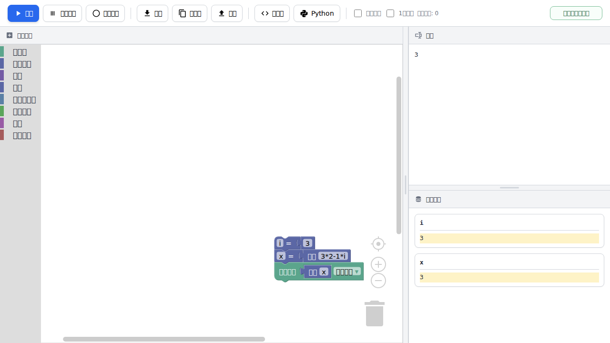

# DNCL Simulator
大学入学共通テストで用いられる疑似言語 **DNCL** を、Blockly のブロックで組み立てて実行できるブラウザ上のシミュレータです。

ブロックを配置してプログラムを作成し、実行結果や内部状態を確認できます。DNCL の学習、授業でのデモ、アルゴリズムの確認に使えます。

## Demo

GitHub Pages で公開されています。

<https://sscramer.github.io/dncl/>



## 特長

- **インストール不要**: GitHub Pages 上でそのまま利用できます。
- **ブラウザだけで動作**: ローカルで使う場合も、ビルド不要で `index.html` から起動できます。
- **DNCL 風のブロックプログラミング**: 変数、配列、条件分岐、繰り返し、関数、入出力などを Blockly で作成できます。
- **実行とステップ実行**: 一括実行、ステップ実行、リセットに対応しています。
- **内部状態の可視化**: 変数や配列の状態を実行中に確認できます。
- **配列の 1 始まり切り替え**: DNCL の学習で使いやすいよう、配列インデックスを 0 始まり / 1 始まりで切り替えられます。
- **XML の保存・読み込み**: 作成したブロックプログラムを XML として保存、読み込み、コピーできます。
- **Python コード表示**: ブロックから生成した Python コードを確認できます。
- **Python からのインポート（β版）**: 基本的な Python コードを Blockly ブロックへ変換できます。
- **デバッグ支援**: ブレークポイント、ステップ戻り（β版）に対応しています。

## 対応している主なブロック

| 分類 | 主なブロック |
| --- | --- |
| 入出力 | 表示、複数項目の表示、外部入力、2 進数表示 |
| 変数と値 | 代入、変数参照、インクリメント / デクリメント、数値、文字列 |
| 配列 | 1 次元配列、2 次元配列、配列全体の代入、要素参照、要素数 |
| 計算 | 自由入力の数式、四則演算、剰余、べき乗、二乗、乱数、リストからランダム選択 |
| 条件と論理 | if、if-else、比較演算、and / or、not |
| 繰り返し | for、while、do-while |
| 関数 | Blockly 標準の関数ブロック |
| デバッグ | ブレークポイント |

## 使い方

### GitHub Pages で使う

次の URL をブラウザで開きます。

```text
https://sscramer.github.io/dncl/
```

画面左側のツールボックスからブロックを選び、ワークスペースに配置してプログラムを作成します。
作成後、画面上部の **実行** を押すとプログラムが実行されます。

### ローカルで使う

リポジトリを取得します。

```bash
git clone https://github.com/sscramer/dncl.git
cd dncl
```

ローカルサーバを起動します。

```bash
python -m http.server 8000
```

ブラウザで次を開きます。

```text
http://localhost:8000/index.html
```

> `index.html` を直接開いても動作する場合がありますが、ファイルの保存・コピー・テストとの相性を考えると、ローカルサーバ経由での利用をおすすめします。

## 基本操作

| 操作 | 説明 |
| --- | --- |
| 実行 | ワークスペース上のプログラムを最後まで実行します。 |
| ステップ | ブレークポイントまたはプログラム終了まで 1 ステップずつ実行します。 |
| 戻る | ステップ実行を戻します。β版機能です。 |
| リセット | 実行結果、内部状態、実行履歴を初期化します。 |
| 保存 | ブロックプログラムを XML ファイルとして保存します。 |
| コピー | Blockly XML をクリップボードへコピーします。 |
| 開く | 保存済み XML ファイルを読み込みます。 |
| コード | ブロックから生成した Python コードを表示します。 |
| Python | Python コードから Blockly ブロックへの変換画面を開きます。β版機能です。 |
| 1始まり | 配列のインデックスを 1 始まりとして扱います。 |

## サンプルプログラム

`sampleprograms/` には、アルゴリズム学習用のサンプル XML が含まれています。

| ファイル | 内容 | 期待される出力 |
| --- | --- | --- |
| `01_sum.xml` | 配列の合計 | `150` |
| `02_factorial.xml` | 階乗 | `3628800` |
| `03_fibonacci.xml` | フィボナッチ数列 | `610` |
| `04_gcd.xml` | 最大公約数 | `6` |
| `05_prime.xml` | 素数判定 | `Prime` |
| `06_linear_search.xml` | 線形探索 | `2` |
| `07_binary_search.xml` | 二分探索 | `2` |
| `08_bubble_sort.xml` | バブルソート | `25,45,72,87,100` |
| `09_string_reversal.xml` | 文字列の反転 | `o,l,l,e,h` |
| `10_change_making.xml` | お釣り計算 | `8` |

読み込み方法:

1. 画面上部の **開く** を押します。
2. `sampleprograms/` 内の XML ファイルを選択します。
3. **実行** を押して結果を確認します。

## Python からのインポート（β版）

画面上部の **Python** から、Python コードを Blockly ブロックに変換できます。

対応している主な構文:

- 変数代入
- リスト
- `input`
- `print`
- `random.choice`
- `if` / `elif` / `else`

複雑な構文や一部の Python 固有機能は正しく変換できない場合があります。変換後は、ブロックの内容と実行結果を確認してください。

## テスト

このリポジトリには Playwright を使った pytest テストが含まれています。

### セットアップ例

```bash
python -m venv .venv
source .venv/bin/activate
pip install pytest pytest-playwright
python -m playwright install
```

Windows の場合は、仮想環境の有効化を次のように行います。

```powershell
.venv\Scripts\activate
```

### 実行

```bash
pytest
```

主なテスト内容:

- `sampleprograms/` の各サンプル XML を読み込んで実行し、出力を検証
- 外部入力の表示順と入力処理を検証
- 自由入力の数式、配列アクセス、エラーハンドリングを検証

## ディレクトリ構成

```text
.
├── index.html                 # アプリ本体
├── screenshot.png             # README 用スクリーンショット
├── sampleprograms/            # サンプルプログラム XML
├── test-programs/             # テスト用 XML
├── test_dncl.py               # サンプルプログラムの実行テスト
├── test_input.py              # 外部入力のテスト
└── test_math_free_input.py    # 自由入力数式と配列アクセスのテスト
```

## 開発メモ

現在の実装は `index.html` にまとまっています。ブロックを追加・変更する場合は、主に次の箇所を更新します。

1. ツールボックス定義
2. Blockly ブロック定義
3. JavaScript 実行用コード生成
4. Python 表示用コード生成
5. 必要に応じてサンプル XML とテスト

Blockly と JS-Interpreter は CDN から読み込まれます。オフライン環境で利用する場合は、ライブラリをローカルに配置する構成へ変更してください。

## 注意事項

- ステップ戻り機能は β 版です。複雑なプログラムでは期待通りに復元できない可能性があります。
- Python からのインポートは β 版です。対応構文は限定的です。
- 無限ループを完全に防ぐものではありません。長時間実行されるプログラムには注意してください。

## Credits

Original project: `DNCL_Simulator`

Author: Shohei Yamazaki (@sscramer)
